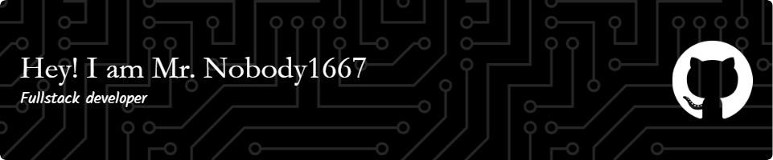

<!--
**mrnobody1667/mrnobody1667** is a ✨ _special_ ✨ repository because its `README.md` (this file) appears on your GitHub profile.

Here are some ideas to get you started:

- 🔭 I’m currently working on ...
- 🌱 I’m currently learning ...
- 👯 I’m looking to collaborate on ...
- 🤔 I’m looking for help with ...
- 💬 Ask me about ...
- 📫 How to reach me: ...
- 😄 Pronouns: ...
- ⚡ Fun fact: ...
-->

  

###

<h1 align="left">👤 Mr. Nobody1667</h1>

###

🌌 "I am nothing. I am everything. I am the shadow in your code."

###

<h2 align="left">🔒 Digital Phantom | 🕵️ Mystery Architect | ✨ Silent Contributor</h2>

###

"Codes are written, but none remember the hand that typed them."

###

<h2 align="left">🌐 Languages I Whisper:</h2>

###

  
  
  
  
  
  
  
  
  

###

<h2 align="left">📜 Manifesto:</h2>

###

Privacy advocate. Open-source wanderer. Solving problems that don’t exist... yet.

###

<h2 align="left">🔗 Find my traces:</h2>

###

    
    

###

<h2 align="left">💌 Contact? Nice try. (But PRs are welcome.)</h2>

###

<h2 align="left">😎Github Stats :</h2>

###

    
    
    
    
  

###

  

###